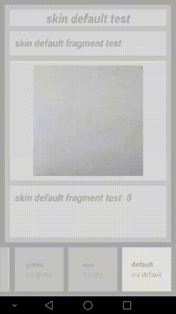

[](https://travis-ci.org/lilong9898/ChangeSkin)

# High Transparency Android Change Skin Framework

[中文README：高透明度安卓换肤框架](README.zh-cn.md)

### Table Of Content
- [Features](#features)
- [Demo](#demo)
- [How to use](#how-to-use)
	- [How to make skin apk](#how-to-make-skin-apk)
	- [How to integrate skin change framework](#how-to-integrate-skin-change-framework)
	- [How to use skin change API](#how-to-use-skin-change-api)
	- [Which are the skinizable attributes](#which-are-the-skinizable-attributes)
	- [Currently supported skinizable views and attributes](#currently-supported-skinizable-views-and-attributes)
	- [Default skin](#default-skin)
- [Insight of the framework](#insight-of-the-framework)
	- [ViewFactory intercepts the inflate process of layout xml files, record skinizable attributes](#viewfactory-intercepts-the-inflate-process-of-layout-xml-files-record-skinizable-attributes)
	- [Parse skin apk, record all the resources it contains](#parse-skin-apk-record-all-the-resources-it-contains)
	- [Build Resources instance of skin apk](#build-resources-instance-of-skin-apk)
	- [Compare resource entries between app and skin apk, search for skinizable resources and attributes](#compare-resource-entries-between-app-and-skin-apk-search-for-skinizable-resources-and-attributes)
	- [Change skin by search result, by calling setter via reflection](#change-skin-by-search-result-by-calling-setter-via-reflection)
	- [Whole process](#whole-process)
	
***

### Features

[toTop](#table-of-content)

#### * dynamically load skin apk for skin resources, no need for apk installation
#### * change skin by reset views' attributes, no need of regenerating any views, or restarting any components
#### * search skinizable attributes by matching resource type and name between app & skin package, no need of using user-defined attributes
#### * support skin change of android.app.Fragment & Activity
#### * support skin change of android.support.v4.app.Fragment & Activity
***
### Demo

[toTop](#table-of-content)



***

### How to use

[toTop](#table-of-content)

Import two projects by Android Studio,  with names of Skin and SkinChange respectively. Project Skin is used to make skin apk, while project SkinChange is the demo app which integrates the framework.

Better not change relative path of these two projects, to ensure demo runs.

#### How to make skin apk

[toTop](#table-of-content)

Skin package is made by project Skin.

Skin apk contains ONLY resources, no codes. Make multiple skin apks of different skins by setting productFlavor.

```Groovy

// Skins used for demo, are DESERT (mostly orange color), GRASS(mostly green color) and SEA(mostly blue color).
// Plus the default skin(mostly gray color), this demo contains 4 skins in total.
productFlavors {
        desert {

        }
        grass {

        }
        sea {

        }
    }
```
Each skin apk contains no java codes, just resources for skin change:
```xml

<!--these are 3 color resources referenced by skin GRASS -->
<!-- the resouce value of these 3 color resource references will be changed to the ones in the new skin apk during skin change-->
<?xml version="1.0" encoding="utf-8"?>
<resources>
    <color name="background">@android:color/holo_green_light</color>
    <color name="tv_title">@android:color/holo_green_dark</color>
    <color name="tv_title_frag">@android:color/holo_green_dark</color>
</resources>
```
When making skin apk, please make sure RES directory structure of each flavor is identical. The resource name should be the same, with only different values. This is to ensure symmetrical appearance of resources in different skin apks. Otherwise if a resource is absent in some skin apks, the value of this resource will NOT change during skin change. 

When RES directories of different skins are ready, run the gradle task defined in build.gradle:
```groovy
task buildSkins(dependsOn: "assembleRelease") {

    delete fileTree(DEST_PATH) {
        include SKIN_APK_FILE_NAME_PATTERN
    }

    copy {
        from(FROM_PATH) {
            include SKIN_APK_FILE_NAME_PATTERN
        }
        into DEST_PATH
    }

}
```
In demo, this task makes 3 skin apks for 3 flavors. They are the skin packages. Their names are in the form of "skin_[SKIN_NAME]". In demo, the gradle task makes skin_desert.apk, skin_grass.apk & skin_sea.apk. These apks are copied & pasted to the ASSET directory of the demo app. When in need of a skin change, framework loads skin apks from ASSET directory and apply them to the demo app, i.e. changing the skin.

#### How to integrate skin change framework

[toTop](#table-of-content)

Demo app corresponds to project SkinChange. It integrates the skin change framework. Please follow these steps:

(1) Application should extend com.lilong.skinchange.base.SkinApplication:
```xml
<application
        android:name=".base.SkinApplication"
        android:allowBackup="true"
        android:icon="@drawable/ic_launcher"
        android:label="@string/app_name"
        android:theme="@style/AppTheme">
        ....
```

(2) Activity should extend com.lilong.skinchange.base.SkinActivity
```java
public class DemoActivity extends SkinActivity {
....
```
(3) Fragment should extend com.lilong.skinchange.base.SkinFragment
```java
public class DemoFragment extends SkinFragment {
...
```
(4) LayoutInflater needs to be acquired from getLayoutInflater() method of SkinActivity & SkinFragment. If system callbacks provide layoutInflater by params, it's ok to use it.

```java
...

// when making a FragmentPagerAdapter, the layoutInflater should be acquired by the getLayoutInflater() method in SkinActivity & SkinFragment.
skinAdapter = new SkinTestFragmentPagerAdapter(getSupportFragmentManager(), getLayoutInflater());
...
```
#### How to use skin change API

[toTop](#table-of-content)

Use changeSkin(Context　context, View rootView, HashMap<String, ArrayList<SkinizedAttributeEntries>> map, SkinInfo info) method of SkinManager to change skin:

```java
...
private SkinManager skinManager;
...
@Override
    protected void onCreate(Bundle savedInstanceState) {
        super.onCreate(savedInstanceState);
        skinManager = SkinManager.getInstance(getApplicationContext());
        ....
         skinManager.changeSkin(getApplicationContext(), getWindow().getDecorView(), getSkinizedAttributeEntries(), info);
         ....
```

The second param, rootView, is the root view of the SkinActivity or SkinFragment, which needs the skin change feature.
The third param, is the data structure needed by the skin change framework. This param can be acquired by getSkinizedAttributeEntries() method of SkinActivity.
The fourth param, is skin apk's info. This param can be acquired by getCurSkinInfo() method of SkinManager, as the info of the current skin. 

Tips: this API works only for the views in the viewTree under rootView. Different activities need their own calls to this API because their rootView are different. 
The rootView of fragment will be added to the rootView of its host activity during fragment add process, so no need for calling this API in fragment. If an activity changes its skin, all the fragments under its management will change their skins too.

#### Which are the skinizable attributes

[toTop](#table-of-content)

**Theretically, all views which have user-defined id, and have attributes that use resouce references, are able to change their skin.**

**If the resouce name and type of certain attribute, are the same as a resource in the skin apk, the resource value will be changed to the one in skin apk. Then this change will be applied to the view by calling the setter of this view's attributes, via reflection.**

**This is the idea of this framework.**

For example, in project SkinChange，i.e. demo app, the root layout of DemoActivity is:
```xml
...
<RelativeLayout
    android:id="@+id/container"
    xmlns:android="http://schemas.android.com/apk/res/android"
    android:layout_width="match_parent"
    android:layout_height="match_parent"
    android:background="@color/background"
    >
    ...
```
Its attribute "background", referenced a resource, whose type is "color", and name is "background". In aforementioned skin_grass.apk, there's also a resource with the same type and name:

```xml
...
<resources>
    <color name="background">@android:color/holo_green_light</color>
    ...
```
So the attribute "background" used in demo app, will get its resource value from skin apk, making a skin change.

#### Currently supported skinizable views and attributes

[toTop](#table-of-content)

Currently, the framework supports skin change of most attributes of View, TextView and ImageView. Other views and attributes can be taken into account by adding more reflection setter calls in
public static void applySkinizedAttribute(View v, String attributeName, Resources skinResources, int skinResId)  method of com.lilong.skinchange.utils.SkinUtil.

#### Default skin

[toTop](#table-of-content)

If no apks whose name is in the form of "skin_[SKIN_NAME].apk", appear in the ASSET directory of project SkinChange, demo app will use its default, mostly gray-color skin. This skin has no corresponding skin apk, because it's just the assembly of initial resource values used by attributes. 

****
### Insight of the framework

[toTop](#table-of-content)

#### ViewFactory intercepts the inflate process of layout xml files, record skinizable attributes

[toTop](#table-of-content)

```java
/**
 * intercept activity content view's inflating process
 * when parsing layout xml, get each view's skinizable attributes and store them for future skin change
 */

public class SkinViewFactory implements LayoutInflater.Factory {

    private static final String TAG = "SkinViewFactory";

    private SkinManager skinManager;
    /**
     * factory of system LayoutInflater, if not null, execute code of this default factory first
     * see if it returns a non-null view
     * this is for android support lib, e.g. FragmentActivity, who set its own factory in onCreate()
     */
    private LayoutInflater.Factory defaultFactory;
    private LayoutInflater skinInflater;

    /**
     * skinized attr map of this factory's inflater's enclosing activity
     */
    private HashMap<String, ArrayList<SkinizedAttributeEntry>> skinizedAttrMapGlobal;

    /**
     * a temporary skinizedAttrMap for immediate skin change when completing inflating this view
     */
    private HashMap<String, ArrayList<SkinizedAttributeEntry>> skinizedAttrMapThisView;

    public SkinViewFactory(LayoutInflater skinInflater, LayoutInflater.Factory defaultFactory, HashMap<String, ArrayList<SkinizedAttributeEntry>> skinizedAttrMap) {
        this.skinManager = SkinManager.getInstance(skinInflater.getContext());
        this.skinInflater = skinInflater;
        this.defaultFactory = defaultFactory;
        this.skinizedAttrMapGlobal = skinizedAttrMap;
        this.skinizedAttrMapThisView = new HashMap<String, ArrayList<SkinizedAttributeEntry>>();
    }

    @Override
    public View onCreateView(String name, Context context, AttributeSet attrs) {

        View v = null;

        if (defaultFactory != null) {
            v = defaultFactory.onCreateView(name, context, attrs);
        }

        try {

            if (v == null) {

                String fullClassName = SkinUtil.getFullClassNameFromXmlTag(context, name, attrs);
                Log.d(TAG, "fullClassName = " + fullClassName);

                v = skinInflater.createView(fullClassName, null, attrs);
            }

            Log.d(TAG, v.getClass().getSimpleName() + "@" + v.hashCode());

            ArrayList<SkinizedAttributeEntry> list = SkinUtil.generateSkinizedAttributeEntry(context, v, attrs);
            for (SkinizedAttributeEntry entry : list) {

                Log.d(TAG, entry.getViewAttrName() + " = @" + entry.getResourceTypeName() + "/" + entry.getResourceEntryName());

                // use attribute type and entry name as key, to identify a skinizable attribute
                String key = entry.getResourceTypeName() + "/" + entry.getResourceEntryName();

                skinizedAttrMapThisView.clear();
                if (skinizedAttrMapThisView.containsKey(key)) {
                    skinizedAttrMapThisView.get(key).add(entry);
                } else {
                    ArrayList<SkinizedAttributeEntry> l = new ArrayList<SkinizedAttributeEntry>();
                    l.add(entry);
                    skinizedAttrMapThisView.put(key, l);
                }

                // immediate skin change of this view
                SkinUtil.changeSkin(skinInflater.getContext(), v, skinizedAttrMapThisView, skinManager.getCurSkinInfo());

                // meanwhile add these skinized attr entries to the global map for future skin change
                if (skinizedAttrMapGlobal.containsKey(key)) {
                    skinizedAttrMapGlobal.get(key).add(entry);
                } else {
                    ArrayList<SkinizedAttributeEntry> l = new ArrayList<SkinizedAttributeEntry>();
                    l.add(entry);
                    skinizedAttrMapGlobal.put(key, l);
                }
            }

        } catch (ClassNotFoundException e) {
            Log.e(TAG, Log.getStackTraceString(e));
        }

        return v;
    }

}
```
A skinizable attribute is recorded as an SkinizedAttributeEntry. One skinizable attribute of one view can be recorded as such a SkinizedAttributeEntry. 
The hashmap of complete attribute name : skinizable attributes, is HashMap&lt;String, ArrayList&lt;SkinizedAttributeEntry>>.
The complete attribute name, i.e. the key of this map, is a string in the form of "[RESOURCE_TYPE]/[RESOURCE_NAME]". 
The skinizable attributes, i.e. the value of this map, are all the attributes which reference such a resource, recorded by SkinViewFactory during the inflation interception. For example, there's a TextView: 

```xml
<TextView
        android:id="@+id/tv_title"
        android:layout_width="wrap_content"
        android:layout_height="wrap_content"
        android:text="@string/tv_title_frag"
        android:textColor="@color/tv_title_frag"
        android:textSize="20sp"
        android:textStyle="bold|italic"/>
```
This view leads to two keys, "string/tv_title_frag" and "color/tv_title_frag",　their corresponding value is a one-element ArrayList. "string/tv_title_frag"'s list contains one skinizedAttributeEntry，which contains a reference to this TextView，attribute name "text"，resource type "string" and resource name "tv_title_frag". “color/tv_title_frag"'s list contains one skinizedAttributeEntry，which contains a refrence to this TextView，attribute name "textColor"，resource type"color" and resource name "tv_title_frag". 

Each SkinActivity/SkinFragmentActivity owns such a skinizedAttrMap，serving as a matching dictionary between app and skin apk.

#### Parse skin apk, record all the resources it contains

[toTop](#table-of-content)

```java
/**
     * use DexClassLoader to get all resource entries in a specified apk
     * dynamic load this apk, no need to install it
     * in this senario, "a specified apk" refers to the skin apk
     *
     * @param hostClassLoader main application's classloader
     * @param apkPath         absolute path of this specified apk
     * @return a list of all the resource entries in the specified apk
     */
    public static ArrayList<ResourceEntry> getSkinApkResourceEntries(Context context, ClassLoader hostClassLoader, String apkPath) {

        ArrayList<ResourceEntry> list = new ArrayList<ResourceEntry>();

        try {
            // odex path of the specified apk is main application's FILES dir
            DexClassLoader dexClassLoader = new DexClassLoader(apkPath, context.getFilesDir().getAbsolutePath(), null, hostClassLoader);
            String packageName = getPackageNameOfApk(context.getPackageManager(), apkPath);

            // get all member classes of R.java, i.e. all resource types in this package
            Class[] memberClassArray = loadMemberClasses(dexClassLoader, packageName + ".R");
            for (Class c : memberClassArray) {
                // get all int type declared fields, i.e. all resource entries in this resource type
                for (Field entryField : c.getDeclaredFields()) {
                    if ("int".equals(entryField.getType().getSimpleName())) {
                        ResourceEntry e = new ResourceEntry(packageName, c.getSimpleName(), entryField.getName(), entryField.getInt(null));
                        list.add(e);
                    }
                }
            }
        } catch (Exception e) {
            Log.e(TAG, Log.getStackTraceString(e));
        }

        return list;
    }
```
A resource is recorded as a ResourceEntry, which contains resource type, resource name, and resource id. These information is acquired by parsing R.java of skin apk via reflection. When finish parsing the resources in a skin apk, the framework returns a list of the resources this apk contains. This is a list of ResourceEntry.

#### Build Resources instance of skin apk

[toTop](#table-of-content)

```java
/**
     * get Resources instance of a specified apk
     * this instance can be used to retrieve resource id/name/value of this apk
     *
     * @param hostResources main application's resources instance
     * @param apkPath       absolute path of the skin apk
     * @return Resources instance of the specified apk
     */
    public static Resources getApkResources(Resources hostResources, String apkPath) {

        try {
            AssetManager am = AssetManager.class.newInstance();
            Method methodAddAssetPath = AssetManager.class.getDeclaredMethod("addAssetPath", String.class);
            methodAddAssetPath.setAccessible(true);
            methodAddAssetPath.invoke(am, apkPath);
            Resources apkResources = new Resources(am, hostResources.getDisplayMetrics(), hostResources.getConfiguration());
            return apkResources;
        } catch (Exception e) {
            Log.e(TAG, Log.getStackTraceString(e));
        }

        return null;
    }
```

#### Compare resource entries between app and skin apk, search for skinizable resources and attributes 

[toTop](#table-of-content)

```java
/**
     * change skin using a specified skin apk
     *
     * @param rootView        rootView of android activity/fragment who is using skin change feature
     * @param skinizedAttrMap hashmap
     *                        key is a skinized attribute identifier, formed as "resource typename/resource entryname"
     *                        value is a list, contains all views that have this kind of skinized attribute
     *                        each ownership relation is a skinizedAttributeEntry
     * @param resourceEntries contains resource entries which are used to match against app's skinized attributes
     * @param fromResources   matched resource entry will get actual resource value from this resources instance
     */
    public static void changeSkinByResourceEntries(View rootView, HashMap<String, ArrayList<SkinizedAttributeEntry>> skinizedAttrMap, ArrayList<ResourceEntry> resourceEntries, Resources fromResources) {

        for (ResourceEntry entry : resourceEntries) {

            String key = entry.getTypeName() + "/" + entry.getEntryName();

            if (skinizedAttrMap.containsKey(key)) {
                ArrayList<SkinizedAttributeEntry> l = skinizedAttrMap.get(key);
                for (SkinizedAttributeEntry e : l) {

                    View v = e.getViewRef().get();
                    //TODO duplicate id within the same view tree is a problem
                    // e.g. when fragment's layout has a child view with the same id as the parent view
                    if (v == null) {
                        v = rootView.findViewById(e.getViewId());
                    }
                    if (v == null) {
                        continue;
                    }

                    SkinUtil.applySkinizedAttribute(v, e.getViewAttrName(), fromResources, entry.getResId());
                }
            }
        }
    }
```
Traverse the resourceEntries in skin apk, compare the resource type and name against skinizable resources, i.e. the SkinizedAttributeEntry list. If there's a match, extract the view reference and id from SkinizedAttributeEntry, thus getting the view, then fetch the resource value from skin apk. Based on the attribute name in SkinizedAttributeEntry and the aforementioned information, call the attribute setter of this view via reflection, changing the skin.

#### Change skin by search result, by calling setter via reflection

[toTop](#table-of-content)

```java
/**
     * reset view's attribute due to skin change
     *
     * @param v             view whose attribute is to be reset due to skin change
     * @param attributeName name of the attribute
     * @param skinResources Resources instance of the skin apk
     * @param skinResId     new attribute's value's resId within Resources instance of the skin apk
     */
    public static void applySkinizedAttribute(View v, String attributeName, Resources skinResources, int skinResId) {

        // android.view.View
        if ("layout_width".equals(attributeName)) {
            // only workable when layout_width attribute in xml is a precise dimen
            ViewGroup.LayoutParams lp = v.getLayoutParams();
            lp.width = (int) skinResources.getDimension(skinResId);
            v.setLayoutParams(lp);
        } else if ("layout_height".equals(attributeName)) {
            // only workable when layout_height attribute in xml is a precise dimen
            ViewGroup.LayoutParams lp = v.getLayoutParams();
            lp.height = (int) skinResources.getDimension(skinResId);
            v.setLayoutParams(lp);
        } else if ("background".equals(attributeName)) {
            Drawable backgroundDrawable = skinResources.getDrawable(skinResId);
            v.setBackgroundDrawable(backgroundDrawable);
        } else if ("alpha".equals(attributeName)) {
            float alpha = skinResources.getFraction(skinResId, 1, 1);
            v.setAlpha(alpha);
        } else if ("padding".equals(attributeName)) {
            int padding = (int) skinResources.getDimension(skinResId);
            v.setPadding(padding, padding, padding, padding);
        } else if ("paddingLeft".equals(attributeName)) {
            int paddingLeft = (int) skinResources.getDimension(skinResId);
            v.setPadding(paddingLeft, v.getPaddingTop(), v.getPaddingRight(), v.getPaddingBottom());
        } else if ("paddingTop".equals(attributeName)) {
            int paddingTop = (int) skinResources.getDimension(skinResId);
            v.setPadding(v.getPaddingLeft(), paddingTop, v.getPaddingRight(), v.getPaddingBottom());
        } else if ("paddingRight".equals(attributeName)) {
            int paddingRight = (int) skinResources.getDimension(skinResId);
            v.setPadding(v.getPaddingLeft(), v.getPaddingTop(), paddingRight, v.getPaddingBottom());
        } else if ("paddingBottom".equals(attributeName)) {
            int paddingBottom = (int) skinResources.getDimension(skinResId);
            v.setPadding(v.getPaddingLeft(), v.
            ......
```

Based on view, name of the skinizable attribute, Resources instance of the skin apk, resource id, the framework calls view's setter to change attribute, thus changing skin.

#### Whole process

[toTop](#table-of-content)

```java
/**
     * change skin using a specified skin apk
     * this apk can be a skin apk, OR this app itself(restore to default skin)
     *
     * @param rootView        rootView of android activity/fragment who is using skin change feature
     * @param skinizedAttrMap hashmap
     *                        key is a skinized attribute identifier, formed as "resource typename/resource entryname"
     *                        value is a list, contains all views that have this kind of skinized attribute
     *                        each ownership relation is a skinizedAttributeEntry
     * @param info            skinInfo which contains the target skin's information
     */
    public static void changeSkin(Context context, View rootView, HashMap<String, ArrayList<SkinizedAttributeEntry>> skinizedAttrMap, SkinInfo info) {

        ArrayList<ResourceEntry> resourceEntries = null;
        Resources resources = null;

        // restore to default skin
        if (info.isSelf()) {
            // parse R.java file of THIS APP's apk, get all attributes and their values(references) in it
            resourceEntries = SkinUtil.getThisAppResourceEntries(context);
            // resources instance from this app
            resources = context.getResources();
        }
        // change skin according to skin apk
        else {
            // parse R.java file of skin apk, get all attributes and their values(references) in it
            resourceEntries = SkinUtil.getSkinApkResourceEntries(context, context.getClassLoader(), info.getSkinApkPath());
            // get Resources instance of skin apk
            resources = SkinUtil.getApkResources(context.getResources(), info.getSkinApkPath());
        }

        changeSkinByResourceEntries(rootView, skinizedAttrMap, resourceEntries, resources);
    }
```

[toTop](#table-of-content)
